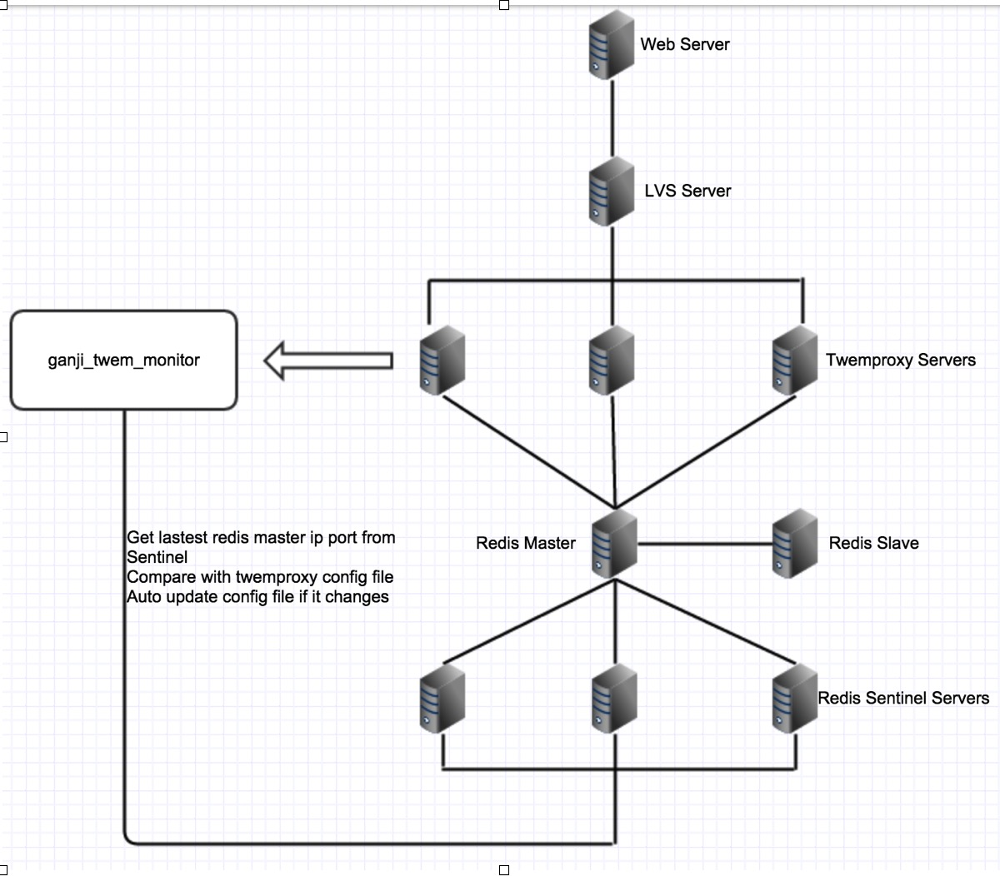

###Twemproxy空闲连接越来越多问题
*	前一段时间线上一个很稳定的twemproxy突然挂掉了，日志显示“to many open files”！惊讶之余，netstat -an发现，连接真的超过了我们设定的65535限制，而且几乎都被其中一个twemproxy打满。然后在看连接这个twemproxy的机器来看，都是来自他们自己业务线的机器，每个机器过来的连接都上万了，要知道，我们是5台twemproxy通过lvs做的负载均衡，相当于每个业务线的client机器和每个twemproxy机器都有10000个连接，且连接状态都是ESTABLISHED，于是很气愤的去找相关开发人员说，你们怎么可以用这么多的连接呢？是不是长连接没有复用？！然后开发很委屈的去看他们的client机器上看，发现他们那边压根就没那么多的连接，也就100左右。那么问题来了，我的这边连接明明摆着，究竟是哪来的呢？！
*	首先介绍我们线上redis环境：
*	

*	client请求redis，会先落在lvs上，lvs通过tunl模式，负载均衡落在5台相同配置的twemproxy机器上（每台twemproxy配置都是相同的，指向同一个redis）,最终所有请求落在一个redis上。
开始一步步排查：

######1，client关闭连接时没有给我发F包或者R包。
*	由于twemproxy作为redis代理，没有关闭idle连接的机制，如果客户端那边关闭连接不发包，就会导致我这边连接越来越多。所以第一步就让开发那边做好对每一个连接做好回收。过了一段时间，发现连接还是越来越多。
*	还是怀疑client那边有关连接没发包，于是搭建了一个测试环境的twemproxy，让开发模拟线上建立连接，请求数据，再关闭连接，我这边抓包，结果，所有一切都是正常的。那么问题就不不在client那边。

######2，怀疑lvs把client发的F包或者R包丢了。
*	咨询了相关人员，觉得这是不可能的，于是把线上通过lvs连接twemproxy的方式改成直接连接后端的其中一台twemproxy，结果发现，没有任何问题，连接是保持很低，且客户端和twemproxy这边连接数能够对的上。那么，难道使我们tunl模式的问题，因为我们MySQL也用到了lvs，但是都是DR模式，但是没出现相同的问题。
*	然后开始换成DR模式，上线测试，发现连接数开始增长，问题跟开始一样。lvs丢包排除。

######3，在lvs上抓包，重新分析
*	自己用python长连接通过lvs连接twemproxy，然后分别在twemproxy机器，lvs，Python的client机器装包，发现，建立连接，请求数据都很正常，然后问题来了，lvs这边的包发现了问题，每隔5s就给client发一个R包，这样，5s后，client这边就把连接关了，twemproxy这边由于没有对idle连接做回收，这个ESTABLISHED连接就一直存在。线上环境中，当lvs发R包把client连接给关闭后，client请求redis时还会在从重连，5s后，client又被关闭，又重连，就这样一直循环着导致twemproxy这边连接越来越多。
*	那么问题来了，lvs为什么会每隔5s就给client发R包，让它断开连接呢？
*	lvs有一个参数，保持连接的时间：
          ipvsadm
          --set tcp tcpfin udp        set connection timeout values
*	就是第一个tcp的时间，由于整个赶集的大环境基本都是php短连接，前段时间负责lvs的同学为了降低lvs机器cpu的使用率，把保持会话的时间从300s设置成了5s，对于短连来说，没有任何问题，但是通过lvs过来的长连接就会保持5s就被lvs这边发R包，让client关闭。
*	所以最后只能临时解决方案把这个时间重新改回300s，twemproxy这边每隔一段时间，在夜里重启释放空闲连接，并做好连接数的监控。
*	现在只能坐等twemproxy那边什么时候能加上对空闲连接回收机制吧.
